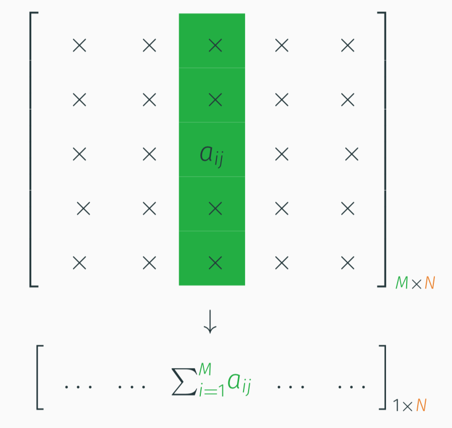

```{r setup, include=FALSE}
knitr::opts_chunk$set(echo = TRUE)
```


## Motivation: scalable kernel operations

Sources: 

- [Presentation](https://gdurif.perso.math.cnrs.fr/files/material/slides_useR_2020_Durif_KeOps.pdf) of [Ghislain Durif](https://gdurif.perso.math.cnrs.fr/) at useR! 2020
- [Documentation of KeOps](https://www.kernel-operations.io/keops/introduction/why_using_keops.html)

[KeOps](http://www.kernel-operations.io/) stands for "Kernel Operations". [RKeOps](https://cran.r-project.org/package=rkeops) is an R package interfacing the KeOps library. 

Kernels are widely used in Statistics and Learning:

- Kernel density estimation
- Classification/Regression: SVM, K-NN, etc...
- Kernel embeddings to compare distributions 
- Interpolation and Kriging
- Optimal Transport

The main motivation behind KeOps is the need to compute fast and scalable kernel operations such as Gaussian convolutions (**RBF kernel products**). For **very large values** of $M$and $N$, given :

- a **target** point cloud $(x_i)_{i=1}^M \in  \mathbb R^{M \times D}$,
- a **source** point cloud $(y_j)_{j=1}^N \in  \mathbb R^{N \times D}$,
- a **signal** $(b_j)_{j=1}^N \in  \mathbb R^{N}$ attached to the $y_j$'s,

KeOps allows you to compute efficiently the array $(a_i)_{i=1}^M \in  \mathbb R^{M}$ given by

$$ a_i =  \sum_j K(x_i,y_j) b_j,  \qquad i=1,\cdots,M,$$
where $K$ is e.g. the Gaussian Kernel: $K(x,y) = \exp\left(-\Vert x_i - y_j \Vert^2/(2\sigma^2) \right)$.

These types of operations involve *reductions* of very large arrays e.g. row-wise or column-wise matrix sums:

```{r fig-reduction, echo=FALSE}

```

### Automatic differentiation

Thanks to KeOps' **automatic differentiation** module, you can also get access to the gradient of the $a_i$'s with respect to the $x_i$'s:

$$   a_i' =  \sum_{j=1}^N \partial_x K(x_i,y_j) b_j,  \qquad i=1,\cdots,M,$$

without having to code
the formula $\partial_x K(x_i,y_j) = -\tfrac{1}{\sigma^2}(x_i - y_j) \exp(-\|x_i - y_j\|^2 / 2 \sigma^2)$!


### One-slide summary

```{r fig-take-home, echo=FALSE}
knitr::include_graphics("img/rkeops_take-home.png")
```


## Installation

Reference: [Installation page](https://www.kernel-operations.io/keops/R/using_rkeops.html)

*The package is only available from UNIX-type platforms*

Installation requires [`cmake`](https://cmake.org/). 

To install `cmake` on a Mac one can use:

```
brew install cmake
```

Then the `rkeops` package can be installed from CRAN:

```{r install, eval=FALSE}
if (!require("rkeops")) {
    install.packages("rkeops")
}
```


## Getting started

```{r load-package}
library("rkeops")
```

RKeOps allows to define and compile new operators that run computations on GPU.

```{r gaussian-convolution}
# implementation of a convolution with a Gaussian kernel
formula = "Sum_Reduction(Exp(-s * SqNorm2(x - y)) * b, 0)"
# input arguments
args = c("x = Vi(3)",      # vector indexed by i (of dim 3)
         "y = Vj(3)",      # vector indexed by j (of dim 3)
         "b = Vj(6)",      # vector indexed by j (of dim 6)
         "s = Pm(1)")      # parameter (scalar)
```

Then we compile the formula:

```{r compile-formula}
# compilation
op <- keops_kernel(formula, args)
```

```{r after-compilation}
# data and parameter values
nx <- 100
ny <- 150
X <- matrix(runif(nx*3), nrow=nx)   # matrix 100 x 3
Y <- matrix(runif(ny*3), nrow=ny)   # matrix 150 x 3
B <- matrix(runif(ny*6), nrow=ny)   # matrix 150 x 6
s <- 0.2
```

If your machine is GPU friendly gpu computation can be turned on, otherwise CPU should be used

```{r use-cpu-gpu}
# use_gpu()
use_cpu()
```

Finally we can perform the desired kernel operation:

```{r doit}
# computation (order of the input arguments should be similar to `args`)
res <- op(list(X, Y, B, s))
str(res)
```

The author of the package is very responsive: he has fixed a [Mac-specific compiling issue](https://github.com/getkeops/keops/issues/89) I had when trying to run this vignette.

## Session information

```{r session-information}
sessionInfo()
```

