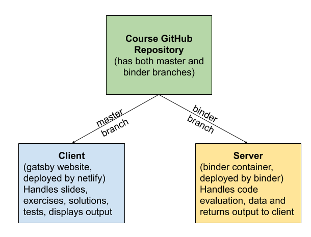

```{r setup, include=FALSE}
knitr::opts_chunk$set(echo = TRUE)
```

## Some ressources

- [CRAN Task View: Teaching Statistics](https://CRAN.R-project.org/view=TeachingStatistics)
- [education.rstudio](https://education.rstudio.com/blog/2020/03/resources-for-teaching-data-science-and-statistics-remotely/)

## Interactive tutorials with the learnr package

The [learnr](https://rstudio.github.io/learnr/) package to turn any R Markdown document into an interactive tutorial.The [gradethis](https://rstudio-education.github.io/gradethis/) package for "grading" student exercises in learnr tutorials. The rstudio [primers](https://rstudio.cloud/learn/primers) constitute great examples of learnr tutorials. 

## Creating a Lesson Repo From Scratch using decampr

Sources : 

- [decampr from_scratch](https://laderast.github.io/decampr/articles/from_scratch.html)
- [decampr](https://github.com/laderast/decampr)


```{r, eval = FALSE}
install.packages("remotes")
remotes::install_github("laderast/decampr")
```

```{r, eval =FALSE}
library(decampr)
library(usethis)
decampr::create_course_repo()
```

## Créer un course sur la plateforme d'Ines Montani (mybinder.org et Netlify)

Ines Montani has developed a course platform that runs R and Python code on [Binder](mybinder.org), which turns a git repo into a collection of interactive notebooks. Binder allows you to create custom computing environments that can be shared and used by many remote users.

How does it work? It takes advantage of mybinder.org's ability to run R in a Docker container. The website itself is hosted on a service such as Netlify, which handles the lesson material, code submission, and displaying results. The code is submitted via JavaScript to the Docker container and results (such as data.frames and ggplot2 figures) are returned to the user on a webpage.
The course repository works with two components: Gatsby (front-end), and Binder (back-end). 


Cons :

- Takes some time to learn. The file structure of the platform takes a little getting used to, with code, exercises, and slides residing in different folders and files. 
- Currently no way to track user completion/award certificates, but perfect for application of providing free lessons on learning R and encouraging students
- Code checking is limited

Pros :

- Scalability. Because it is hosted on mybinder.org, a free service, the course scales very well. We have had hundreds of users run the RBootcamp, and we have had very few hiccups. Without this ability, we could not offer our course for free for everyone globally.
- Free for right now. Solutions such as LearnR are great, but they require a shinyapps.io account to host the material, which have limited bandwidth for the free accounts, and more access costs money. Ines’ platform is dependent on two services that are currently free: mybinder.org and netlify.
- Separates out code from content. DataCamp lessons are organized into chapters that contain instructions and then an interactive coding platform that gives code scaffolding, hints and solutions. This allows students to learn interactively by following instructions to complete code prompts within an R environment. Ines’ platform allows for similar interactivity, but separates out the slide contents from the code. This is very helpful in testing and debugging the code.
- Works on phone browsers. 

### Comment faire en pratique ?

1. Import a minimal repo, for example [course-starter-r](https://github.com/ines/course-starter-r), install it and make sure the app is running locally.
2. Customize the meta.json and binder/install.R.
3. Build a [Binder](https://mybinder.org/) from the binder branch of this repo.
4. Add content (chapters, exercises and slides) and optionally add separate content license.
5. Customize the UI theme in theme.sass and update images in static as needed.
6. Deploy the app, e.g. to [Netlify] (https://netlify.com/).

#### Details pour faire tourner l'app en local

On commence par installer Gasby, générateur de site web ainsi que ses autres dépendances avant de lancer le serveur, qui sera sur localhost:8000.

A noter qu'il est nécessaire d'avoir Node.js installé au préalabl et que les versions disponibles par défaut dans les dépôts apt sont obsolètes (8.5.x). Sous Ubuntu 18.04 LTS, on peut installer des versions récentes de NodeJS et npm (NodeJS Package Manager) via les commandes suivantes:
```{bash, eval = FALSE}
# Using Ubuntu
curl -sL https://deb.nodesource.com/setup_14.x | sudo -E bash -
sudo apt-get install -y nodejs
```
Sous windows, on installe Nodejs depuis https://nodejs.org/en/ puis installer le package `windows-build-tools` avec la commande `npm install --global windows-build-tools --vs2015` dans une invite de commande lancée en mode administrateur.

On peut vérifier que l'installation s'est bien passée et que les numéros de version sont les bons via: 
```{bash verif_versions, eval = FALSE}
node -v # Besoin d'une version > 10.15
npm -v
```

On peut construire le site en local via:

```{bash for_local_server, eval = FALSE}
sudo npm install -g gatsby-cli  # Install Gatsby globally
npm install                # Install dependencies
npm run dev                # Run the development server
```

A noter que npm notice crée un fichier package-lock.json qu'il faut copier à la place de celui présent à la racine du répertoire. Sous ubuntu 18.04 LTS, la dernière commande ne permet pas de générer le site web... (mais Julie a réussi sur son Mac) 

### La structure du répertoire



Two branches in the repository :

- Course material, exercise code, and slide material live in the master branch (chapters, exercices, slides). 

exercises/solutions/tests
chapter.md files
slides (using reveal.js)

- Data and the docker related files to build the container live in the binder branch.
La branche binder comprend 2 fichiers, install.R qui liste les packages à installer. On peut ajouter un dossier `data/` comprenant les chemins vers les données.
```{r install.R, eval = FALSE}
install.packages("tidyverse")
install.packages("rjson")
```

et un fichier runtime.txt qui ressemble à `r-2019-04-10`.

## Déployer le cours sur un site web avec binder

### Remarque (pour le framework d'Inès Montani)

One note on the Docker container, that is built on mybinder.org: while the install.R method works, we recommend building on existing work through using a Dockerfile.

### Alternative (tutoriaux distribués via un package)

Si les tutoriaux sont ditribués comme recommandés par les auteurs de `learnr`, c'est à dire dans le dossier `inst/tutorials/` d'un package, on peut créer un binder très facilement via [mybinder.org](https://mybinder.org/) et déployer des serveurs Rstudio à la volée via le lien fourni de type (https://mybinder.org/v2/gh/mahendra-mariadassou/L1fdvGenetics/master?urlpath=rstudio). Le suffixe `?urlpath=rstudio` permet de lancer une instance de rstudio dans le binder. 


#### Points d'attention

- faire une branche dédiée `binder` (qui se met à jour lentement) pour éviter de reconstruire un binder à chaque commit "cosmétique"
- faire pointer le binder sur la branche binder
- attention à spécifier la bonne date dans `runtime.txt` (pour avoir les bonnes versions de package)
- la construction du binder prend du temps (plusieurs minutes)
  - il est gardé en cache un certain temps 
  - il est recommandé de cliquer lancer un binder la veille / quelques heures avant le cours pour que les échantillons puissent charger la version en cache rapidement (~ 1-2 minutes)


