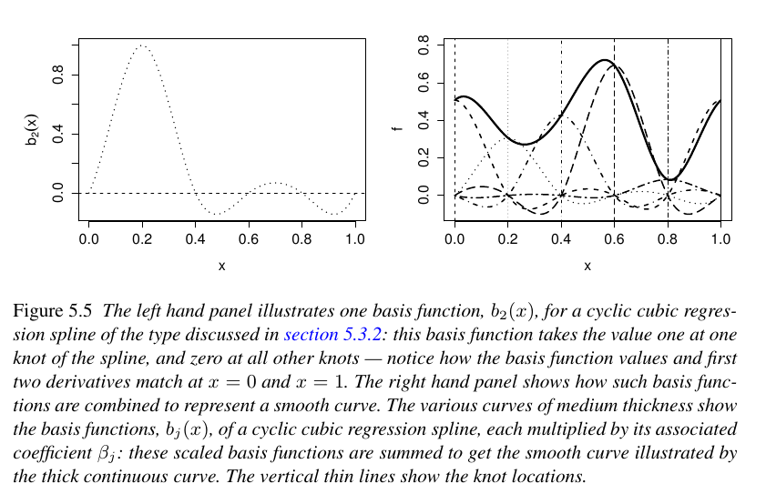

```{r setup, include=FALSE}
knitr::opts_chunk$set(echo = TRUE)
```


[](https://mybinder.org/v2/gh/stateofther/finistR2020/website?filepath=gam.Rmd)

## Modèles additifs généralisés

Un modèle additif généralisé est un GLM dans lequel le prédicteur linéaire fait intervenir une somme de fonctions régulières des covariables.
Les modèles additifs généralisés ont une structure de la forme suivante
$$g(\mu_i)=A_i\theta+\sum_j f_j(x_{ji}),\, Y_i\sim\text{EF}(\mu_i,\phi)$$
où $Y_i$ est la variable réponse et $\text{EF}(\mu_i,\phi)$ est une distribution de famille exponentielle de moyenne $\mu_i$ et de paramètre d'échelle $\phi$ et $A_i\theta$ représente une componente paramétrique dans la modélisation.

Pour estimer les $f_j$, on les décompose sur une base de splines. On note $b_{jk}(x)$ la $k$ème fonction de la base de splines choisie, on suppose que $f_j$ s'écrit
$$f_j(x)=\sum_{k=1}^l b_{jk}(x)\beta_{jk},$$
avec $\beta_{jk}$ inconnu.

## Base de splines 

On veut construire une base de $k$ fonctions splines $(s_1, \ldots, s_k)$. Pour ceci, ondéfinit $k$ noeuds, par défaut les extréminités correspondent à $x_{min}$ et $x_{max}$.

Chaque fonction $s_i$ vaut 1 au noeud $i$ et 0 aux autres noeuds. En outre. Chaque fonction spline (cublique) est le recollement de $k$ polynomes de degré 3 assurant une fonction  de classe $C^2$  sur l'intervalle, comme illustré ci-dessous (extrait du livre de S. Wood).





```{r}
library(mgcv)
library(tidyverse)
library(MASS)
```


```{r}
Mods3 <- gam(accel~s(times,k=10,bs="cr"),data=mcycle)
gam.check(Mods3)
summary(Mods3)
```

$$Y_i = Z_i^T\theta + \sum_{j=1}^p \beta_j f_j(x_{i}) + \epsilon_i$$
où les $f_j$ forment une base de spline, $Z_i$ des variables utilisées comme dans un modèle linéaire, et $x_i$ la variable pour laquelle on utilise une spline. Notons qu'on peut avoir des splines multivariés et plusieurs splines dépendant de différentes variables.

Dans le tableau, Parametric Coefficients correspond à la partie des effets linéaires et la partie smooth terms correspond au test sur la variable dont dépend le spline.

La dernière partie contient des informations sur la qualité d'ajustement du modèle type $R^2$ et variance estimée.

Ce tableau contient les $\beta_j$ devant les splines :
```{r}
coef(Mods3)
```


## Autres références :

  - Elements of Statistical learning. Hastie et al.
  - [Site avec exemple](https://m-clark.github.io/generalized-additive-models), les données sont [ici](https://github.com/m-clark/generalized-additive-models/tree/master/data) 
  - [Livre de Simon Wood](https://b-ok.cc/book/2945925/6817d4)
  - [autre ref](http://environmentalcomputing.net/intro-to-gams/)
  - [formation GAM en R](https://noamross.github.io/gams-in-r-course/)


