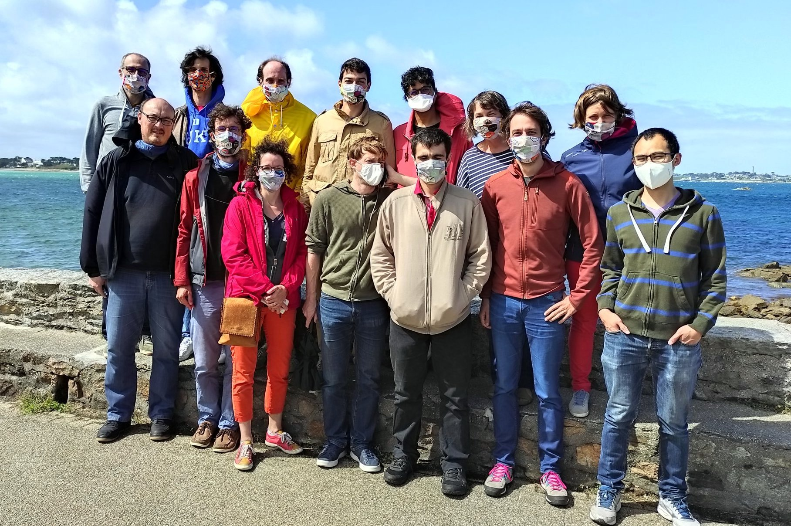

```{r setup, include=FALSE}
knitr::opts_chunk$set(echo = FALSE, cache = TRUE)
library(tidyverse)
library(DT)
```

## Où ? Quand ?

La station biologique de Roscoff va accueillir  la quatrième édition du R Bootcamp  du groupe  [State Of The R](https://stateofther.github.io/) **du 22 août  au 28 août 2020**.

<iframe src="https://www.google.com/maps/embed?pb=!1m17!1m11!1m3!1d863.0230997053625!2d-3.987533179360306!3d48.72647094495075!2m2!1f0!2f0!3m2!1i1024!2i768!4f13.1!3m3!1m2!1s0x4813e153cbdda967%3A0x6cd2956ee2bb8cfb!2sStation+Biologique+de+Roscoff!5e1!3m2!1sfr!2sfr!4v1557410926937!5m2!1sfr!2sfr" width="600" height="450" frameborder="0" style="border:0" allowfullscreen></iframe>


## Qui

```{r picture_group, echo = FALSE, fig.cap="The COVID Survivors"}

```

### 1er rang

- [Pierre Navaro](https://irmar.univ-rennes1.fr/interlocuteurs/pierre-navaro) (IRMAR - CNRS)
- [Pierre Gloaguen](https://papayoun.github.io/) (UMR MIA Paris - AgroParisTech)
- [Julie Aubert](https://www6.inra.fr/mia-paris/Equipes/Membres/Julie-Aubert) (UMR MIA Paris - INRAE),
- [Julien Chiquet](https://jchiquet.github.io) (UMR MIA Paris - INRAE),
- [Baptiste Alglave](https://halieutique.agrocampus-ouest.fr/fr/personne/303) (AgroCampusOuest ),
- [Gaspar Massiot](https://gasparmassiot.wordpress.com/) (UMR MIA Paris - INRAE),
- [Tâm Le Mihn](https://www.linkedin.com/in/tamleminh/?originalSubdomain=fr) (UMR MIA Paris - INRAE),

### 2ème rang

- [Pierre Neuvial](https://www.math.univ-toulouse.fr/~pneuvial/) (IMT - CNRS)
- [Pierre Barbillon](https://www6.inra.fr/mia-paris/Equipes/Membres/Pierre-Barbillon) (UMR MIA Paris - AgroParisTech)
- [Saint-Clair Chabber-Liddell](https://github.com/Chabert-Liddell) (UMR MIA Paris - INRAE)
- [Antoine Bichat](https://abichat.github.io/) (UMR MaIAGE - INRA)
- [Mahendra Maridassou](https://mahendra-mariadassou.github.io/) (UMR MaIAGE - INRAE)
- [Marie-Pierre Étienne](https://marieetienne.github.io/) (IRMAR - Agrocampus Ouest)
- [Sophie Donnet](https://www6.inra.fr/mia-paris/Equipes/Membres/Sophie-Donnet) (UMR MIA Paris - INRAE),


## Quoi

Cette semaine sera consacrée  à l'approfondissement de diverses thématiques (méthodologiques, techniques) autour du logiciel `R`: ce site proposera un compte rendu des différents thèmes abordés. Les participants collaborent tous au contenu de ce site lors d'ateliers organisés en petits groupes.

Les compte rendu des éditions précédentes sont disponibles 

  - [Finist'R 2019](https://stateofther.github.io/finistR2019/)
  - [Finist'R 2018](https://stateofther.github.io/finistR2018/)
  - [Finist'R 2017](https://stateofther.github.io/finistR2017/)

## Programme 

```{r}
prog <- readODS::read_ods(path = "Programme.ods") 
activites <-
  prog %>%  
  gather(key = condition, value = activité, -Horaire) %>%  
  distinct(activité) %>% 
  as_vector()
color_used <-
  activites %>%
  enframe(name = NULL) %>%
  mutate(col = case_when(str_detect(value, "Bilan")        ~ "#97b1bd",
                         str_detect(value, "Atelier 1")    ~ "#def7cf",
                         str_detect(value, "Atelier 2")    ~ "#c3f2a7",
                         str_detect(value, "Atelier 3")    ~ "#b5f48d",
                         str_detect(value, "Atelier 4")    ~ "#96e863",
                         str_detect(value, "Restitution")  ~ "#fea741",
                         str_detect(value, "Webinar")      ~ "#fea741",
                         str_detect(value, "Introduction") ~ "#fea741")) %>% 
  pull(col)
prog %>% 
  datatable(options = list(pageLength = 24, dom = "t", ordering = FALSE),
            rownames = FALSE) %>%
  formatStyle(columns = c(2:ncol(prog)),
              backgroundColor = styleEqual(activites , color_used))
```

Les séquences en vert correspondent à des séances d'atelier en sous groupes. Les séquences en orange correspondent à des sujets abordés collectivement, tandis que les séquences en bleu correspondent à des temps de réflexion et rédaction sur le rendu final.
