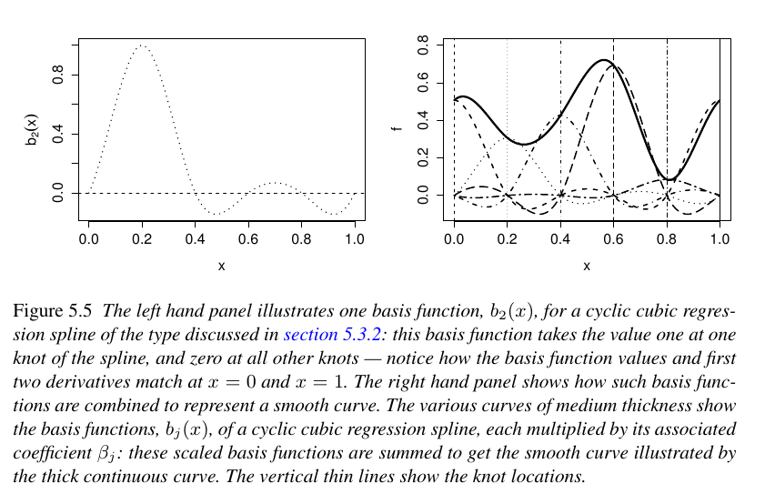

```{r setup, include=FALSE}
knitr::opts_chunk$set(echo = TRUE)
```

## Base de splines 

On veut construire une base de $k$ fonctions splines $(s_1, \ldots, s_k)$. Pour ceci, ondéfinit $k$ noeuds, par défaut les extréminités correspondent à $x_{min}$ et $x_{max}$.

Chaque fonction $s_i$ vaut 1 au noeud $i$ et 0 aux autres noeuds. En outre. Chaque fonction spline (cublique) est le recollement de $k$ polynomes de degré 3 assurant une fonction  de classe $C^2$  sur l'intervalle, comme illustré ci-dessous (extrait du livre de S. Wood).





```{r}
library(mgcv)
library(tidyverse)
```


